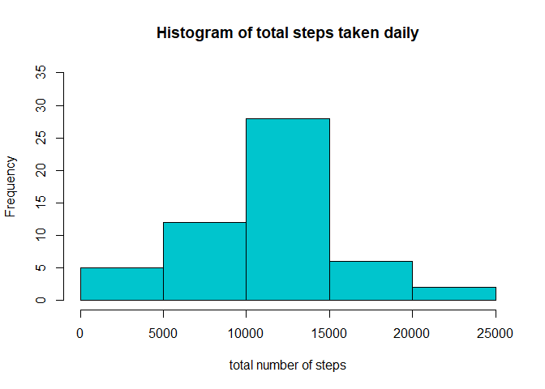

## Loading and preprocessing the data


```r
library(dplyr)
library(ggplot2)
```

1. Load the data 


```r
activity <- read.csv("./activity/activity.csv")
```

2. Process/transform the data into a format suitable for analysis


```r
activity$date <- as.Date(activity$date)
```


## What is mean total number of steps taken per day? (This section ignores missing values)

The following code chunk filters out missing values and computes the total number of steps taken daily.


```r
activity_valid <- activity[complete.cases(activity),]
activity_valid_bydate <- group_by(activity_valid, date)
daily_total_steps <- summarize(activity_valid_bydate, total_steps = sum(steps))
```


1. Histogram of the total number of steps taken each day 


```r
hist( daily_total_steps$total_steps, xlab = "total number of steps", ylim = c(0,35), col = "turquoise3",
      main = "Histogram of total steps taken daily")
```

<!-- -->


2. Mean total number of steps taken per day is computed by the following R code.


```r
mean(daily_total_steps$total_steps)
```

```
## [1] 10766.19
```

3. Median total number of steps taken per day is computed by the following R code.


```r
median(daily_total_steps$total_steps)
```

```
## [1] 10765
```


## What is the average daily activity pattern?

1. The following code chunk the number of steps taken in the 5-minute intervals averaged across all days.


```r
activity_valid$interval <- as.factor(activity_valid$interval)
activity_valid_byinterval <- group_by(activity_valid, interval)
activity_valid_byinterval_mean <- summarize(activity_valid_byinterval, mean_steps = mean(steps))
```

2. Time series plot of the 5-minute interval vs average number of steps taken, is generated by the following code chunk.


```r
activity_valid_byinterval_mean$interval <- as.numeric(as.character(activity_valid_byinterval_mean$interval))
with( activity_valid_byinterval_mean, plot(as.numeric(interval), mean_steps, col = "violetred1",
                                           type = "l", ylab = "Average number of steps", xlab = "Time Interval"))
```

<!-- -->

3. The following code chunk computes Which 5-minute interval, on average across all the days in the dataset, contains the maximum number of steps?


```r
max_step_interval_index <- which.max(activity_valid_byinterval_mean$mean_steps)
activity_valid_byinterval_mean$interval[max_step_interval_index]
```

```
## [1] 835
```

## Inputing missing values

The following code chunk reports the total number of rows with missing values in the dataset (i.e. NAs)


```r
sum(!complete.cases(activity))
```

```
## [1] 2304
```

The following code chunk replaces the missing values in the dataset by the *mean value for that 5-minute interval rounded off to the nearest integer* to generate a new dataset that is equal to the size of the original dataset. 


```r
activity_invalid <- activity[ !complete.cases(activity),]
activity_invalid$interval <- as.factor(activity_invalid$interval)
for( idx in 1:nrow(activity_invalid)){
  activity_invalid$steps[idx] <-  activity_valid_byinterval_mean$mean_steps[ activity_invalid$interval[idx] == 
                                                                        activity_valid_byinterval_mean$interval] 
}

activity_new <- rbind(activity_valid, activity_invalid)
```

The following code computes the total number of steps taken each day,


```r
activity_new_bydate <- group_by(activity_new, date)
daily_new_total_steps <- summarize(activity_new_bydate, total_steps = sum(steps))

hist( daily_new_total_steps$total_steps, xlab = "total number of steps", ylim = c(0,40), col = "salmon3",
      main = "Histogram of total steps taken daily with replaced missing values")
```

<!-- -->


mean of the total number of steps taken per day,


```r
mean(daily_new_total_steps$total_steps)
```

```
## [1] 10766.19
```


and the median total number of steps taken per day.


```r
median(daily_new_total_steps$total_steps)
```

```
## [1] 10766.19
```


**Do these values differ from the estimates from the first part of the assignment?** The mean estimate remains the same while the median estimate is slightly different.

**What is the impact of imputing missing data on the estimates of the total daily number of steps?** The median estimate which was quite close to the mean estimate in the first computation, matches the mean estimate after inputting missing values. 


## Are there differences in activity patterns between weekdays and weekends?

This section uses the dataset with the filled-in missing values. The following code chunk creates a new factor variable in the new activity data set called *day_type* indicating whether it is a weekday or weekend.


```r
activity_new$date <- as.Date(activity_new$date)

activity_new <- mutate(activity_new, day_type = "Weekday")  
for( idx in 1:length(activity_new$date)){
  dow <- weekdays(activity_new$date[idx])
  if ( dow == "Saturday" | dow == "Sunday")
    activity_new$day_type[idx] <- "Weekend"
}
activity_new$day_type <- as.factor(activity_new$day_type)
```

The following code chunk generates a panel plot containing time series plots of the 5-minute interval and the average number of steps taken, averaged across all weekday or weekend days. 

It can be observed from the plots that during weekdays there is a peak in the average number of steps between intervals 800 - 900, whereas during weekends this peak is not as high as during weekdays. This matches with the movement of someone working in an office and goes out during lunch hour. On weekdays the person seems to be active in a more consistent manner throughout the daytime. In both categories there is little movement recorded during the early intervals upto 500. Again after about interval 2100 average movement starts to diminish.  


```r
activity_new<- group_by( activity_new, day_type, interval)

mean_steps_by_daytype <- summarize( activity_new, mean_steps = mean(steps))

mean_steps_by_daytype$interval <- as.numeric(as.character(mean_steps_by_daytype$interval))

ggplot(data = mean_steps_by_daytype) + 
  geom_line( aes(interval, mean_steps, colour = day_type) ) + 
  facet_wrap( vars(day_type), nrow = 2)+
  ylab("Average number of steps") +
  xlab("Time Interval")
```

<!-- -->


 


